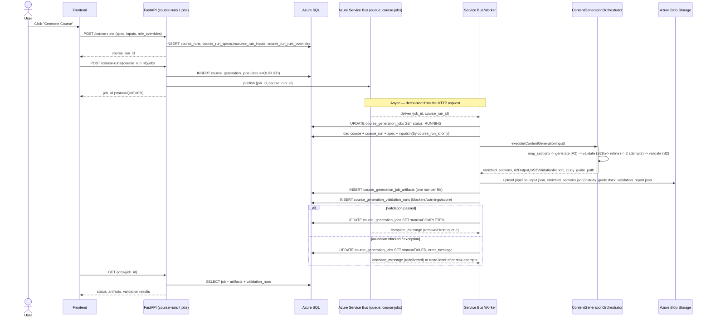

# Lectora Backend (refine)

FastAPI backend for AI-assisted course generation: takes source study-guide
documents (DOCX/PDF), generates a timed outline, learning objectives, and
full course content, validates the content against a rule pack, and renders
a study-guide `.docx`.

## Stack

- **API**: FastAPI + Uvicorn
- **DB**: Azure SQL (or local SQLite) via SQLAlchemy + Alembic migrations
- **LLM**: Azure OpenAI via [Semantic Kernel](https://github.com/microsoft/semantic-kernel) (`app/kernel/`)
- **Storage**: Azure Blob Storage (job artifacts) + Azure Service Bus (job queue)
- **Retrieval**: Azure AI Search (document ingestion / chunk retrieval)
- **Tracing**: Langfuse + local JSONL traces

## Project layout

```
app/
  api/            FastAPI routers and dependencies
                  v1/endpoints/onboarding/         course-basic, course-run, learning-objective,
                                                    required-topic, timed-outline, documents
                  v1/endpoints/content_generation/ course generation job endpoints
                                                    (POST /course-runs/{id}/jobs, GET /jobs/{id})
  core/           Settings/config (Azure SQL, Azure OpenAI, Langfuse, ...)
                  service_bus/    Azure Service Bus integration — settings, message models,
                                  client factory, publisher, consumer, and the background
                                  worker that bridges queue messages to the pipeline runner.
                                  All Service Bus code lives here; nothing else in the app
                                  talks to Service Bus directly.
  db/             SQLAlchemy session + Alembic migrations + lookup-table seeding
  kernel/         Semantic Kernel factory, chat helpers, model registry
  models/
    onboarding/         course_basic, course_run (+ spec/input/rule-override), learning_objective
    course_generation/  course_generation_jobs, course_generation_job_artifacts,
                        course_generation_job_status, course_generation_validation_runs
  orchestrators/  High-level orchestrators (topic_outline, learning_objective,
                  required_topics, content_generation) built on app/kernel
  ai/             Pipeline agents and shared pipeline infrastructure
                  agents/            content_generation_agent, to_generation_pipeline,
                                     learning_objective_agent, required_topic
                  rule_pack_config/  rule-pack resolution (content generation + timed outline)
                  shared_llm_config/ back-compat shim onto app/kernel + tracer
                  shared_utils/      course-id resolution, outline cleanup, learning
                                     objectives, interactive elements, image validation
  repositories/   Data-access layer (course_basic/, course_run/, course_generation/)
  schemas/        Pydantic request/response schemas
  services/
    onboarding/         Application services for onboarding CRUD resources
    course_generation/  Job lifecycle (job_service), DB->pipeline-input loading
                        (data_loader), artifact persistence (artifact_service), and
                        the end-to-end pipeline runner (pipeline_runner) invoked by
                        the Service Bus worker
```

### Content generation job flow

`POST /course-runs/{course_run_id}/jobs` persists a `QUEUED` row in
`course_generation_jobs` and publishes a minimal `{job_id, course_run_id}`
message to the Azure Service Bus queue (`core/service_bus/publisher.py`). A
background worker (`core/service_bus/worker.py`, started from `app.main`'s
lifespan) consumes that queue and calls
`CourseGenerationPipelineRunner.run()` (`services/course_generation/`), which:

1. Loads every input the pipeline needs from the DB — course, run, spec,
   uploaded inputs — purely from `course_run_id` (`data_loader.py`).
2. Runs `ContentGenerationOrchestrator` (unchanged, no Service Bus knowledge).
3. Persists artifacts (pipeline input snapshot, enriched sections, rendered
   study guide, validation report) into `course_generation_job_artifacts`.
4. Persists validation results into `course_generation_validation_runs`.
5. Updates `course_generation_jobs.status_code` through
   `QUEUED -> RUNNING -> COMPLETED`/`FAILED`, keyed by `job_id` so a retry
   after a crash can resume from the persisted job/artifact state instead of
   starting over.

`GET /jobs/{job_id}` returns the job's current status plus every artifact and
validation run persisted so far.

#### Flow diagram



Key properties this diagram highlights:

- **Minimal queue payload**: only `job_id` and `course_run_id` cross the wire —
  the worker re-loads everything else from the DB, so the message never goes
  stale relative to what's persisted.
- **Resumable by design**: every state transition and every artifact is
  committed against `job_id` as it happens. If the worker process dies
  mid-run, the job is left `RUNNING` with whatever artifacts made it to the
  DB — a future retry can inspect those rows instead of starting from zero,
  and peek-lock semantics mean an unacknowledged message is redelivered
  rather than lost.
- **Orchestrator stays queue-agnostic**: `ContentGenerationOrchestrator` has
  no Service Bus import — the worker is the only thing that knows about the
  queue, per `core/service_bus/`'s isolation from the rest of the app.

## Getting started

1. **Python**: 3.11+ (a `venv/` is expected at the repo root; recreate with
   `python3 -m venv venv` if missing).
2. **Install dependencies**:
   ```bash
   source venv/bin/activate
   pip install -r requirements.txt
   ```
3. **Configure environment**: copy `.env.example` to `.env` and fill in the
   values you need (Azure SQL or a local SQLite `DATABASE_URL`, Azure OpenAI,
   Azure Storage/Service Bus, Azure AI Search, Langfuse). See `.env.example`
   for the full list and inline notes.
4. **Database migrations**:
   ```bash
   alembic upgrade head
   ```
5. **Run the API**:
   ```bash
   uvicorn app.main:app --reload
   ```
   The app initializes the DB schema on startup, seeds lookup tables (job
   status codes), starts the Service Bus worker if configured, and exposes
   routes under `/health`, `/course-basic`, `/course-run`, and
   `/course-runs/{id}/jobs` + `/jobs/{id}` (see `app/api/v1/api.py`).

## Configuration notes

- Minimum to boot: a working database connection (`AZURE_SQL_*` or
  `DATABASE_URL`) and `LOG_LEVEL`.
- LLM generation requires `AZURE_OPENAI_ENDPOINT` / `AZURE_OPENAI_API_KEY`;
  per-agent model deployments are resolved dynamically via
  `app/kernel/model_registry.py` (overridable without a restart).
- Document ingestion/retrieval (Section Mapper's vector search) requires
  `AZURE_SEARCH_*` and the embeddings resource vars — without them, retrieval
  degrades gracefully (no matched source chunks) rather than failing.
- Content-generation rule packs (word-count targets, tone, error tolerance)
  currently ship as generic placeholders in `app/ai/rule_pack_config/`
  pending the real business rules.
- Triggering generation requires `SERVICE_BUS_CONNECTION_STRING` and
  `QUEUE_NAME` (defaults to `course-jobs`); without a connection string the
  worker logs a warning and stays idle, but `POST /course-runs/{id}/jobs`
  will still fail when it tries to publish — configure Service Bus before
  exercising the generation flow end-to-end.

## Known gaps

- `app.orchestrators.topic_outline` is mid-fix: `app/ai/agents/to_generation_pipeline/`
  still has a handful of leftover imports from the removed `lectora_backend`
  package (course-id resolution, outline cleanup, learning-objective
  normalization, and the timed-outline rule pack) that need native
  replacements under `app/ai/shared_utils/` and `app/ai/rule_pack_config/`.
- `app.orchestrators.content_generation`, `app.orchestrators.learning_objective`,
  and `app.orchestrators.required_topics` all import cleanly today. The old
  `content_generation_agent/pipeline.py` and `lesson_gate.py` (legacy,
  file-based `shared_state.json` code tied to a "central orchestrator"
  framework that no longer exists) have been removed — fully superseded by
  `app.orchestrators.content_generation.ContentGenerationOrchestrator`.
- **API ↔ Pipeline wiring**: done. `POST /course-runs/{course_run_id}/jobs`
  queues a job via Azure Service Bus and a background worker invokes
  `ContentGenerationOrchestrator` — see "Content generation job flow" above.
  Still open: a retry/resume endpoint that re-publishes a `FAILED` job's
  message instead of creating a new job row, and a `by-course-slug` /
  cancel-job path to match the frontend's `jobs/api.ts` client surface.
