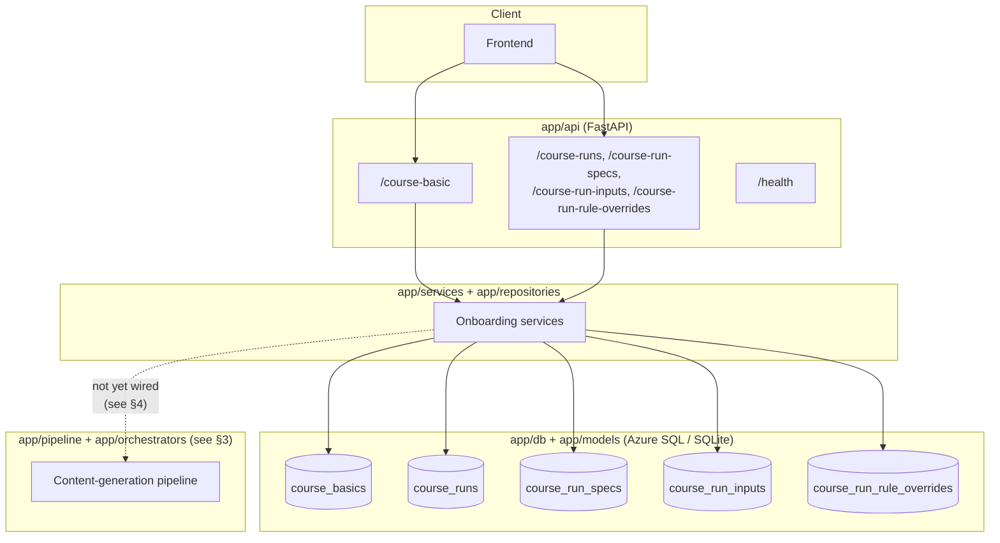
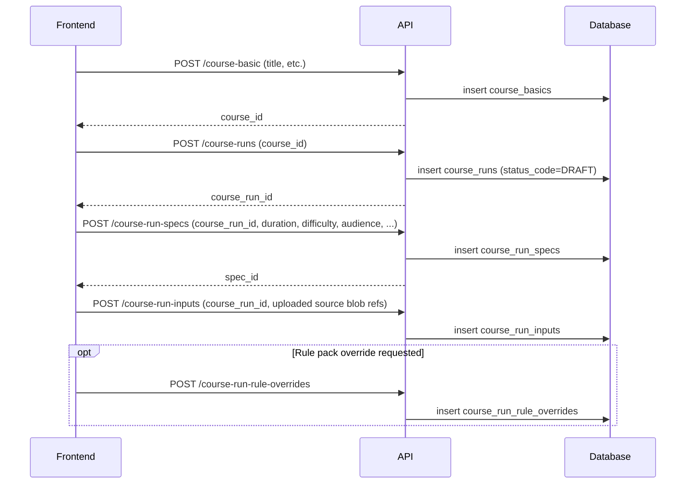
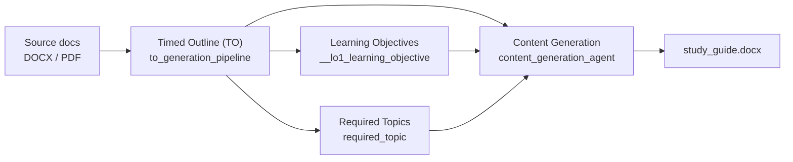
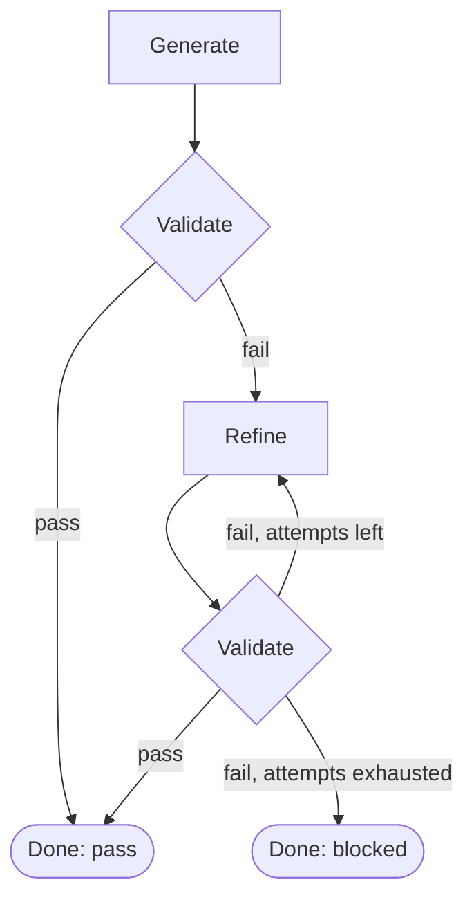
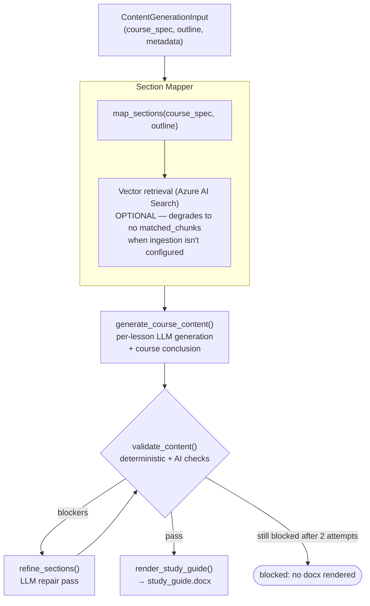

# Workflow & Architecture

This document describes how the pieces of `lectora_BE_refine` fit together:
the onboarding data model exposed over the API today, and the course-generation
pipeline that runs on top of it (agents + orchestrators).

## 1. High-level architecture

- **API layer** (`app/api/v1/endpoints/onboarding/`): CRUD for course
  metadata and generation parameters. No endpoint currently *triggers* the
  generation pipeline — see [§4](#4-known-gap-api--pipeline-are-not-yet-wired-together).
- **Services/repositories**: standard service-per-resource pattern; each
  service owns validation + persistence for one table.
- **DB**: SQLAlchemy models + Alembic migrations under `app/db/migrations`.
- **Pipeline**: the LLM-driven agents and orchestrators described below —
  runnable directly today, not yet reachable from an HTTP endpoint.

## 2. Onboarding data flow

A course goes through a small state machine of records before generation can
run:

- **CourseBasic** — a course's identity (title, etc.).
- **CourseRun** — one *generation attempt/version* for a course
  (`status_code`: `DRAFT` → ... ; `version_number` supports regeneration,
  `created_from_run_id` chains a new run back to the one it was derived from).
- **CourseRunSpec** — the generation parameters for a run: duration,
  difficulty, target audience, tone/depth/emphasis, required topics /
  learning objectives (as JSON), rule-pack selection, and an optional
  uploaded outline.
- **CourseRunInput** — references to previously-uploaded source documents
  (DOCX/PDF) attached to a run.
- **CourseRunRuleOverride** — an explicit rule-pack override for a run.

## 3. Content-generation pipeline

Once a run has a spec + inputs, the pipeline turns source documents into a
validated, rendered course. It is organized as **agents**
(`app/pipeline/agents/...`) composed by **orchestrators**
(`app/orchestrators/...`), all built on the shared Semantic Kernel
integration in `app/kernel/`.

### 3.1 Semantic Kernel foundation (`app/kernel/`)

- `factory.py::create_kernel()` — builds a `semantic_kernel.Kernel`, registers
  an `AzureChatCompletion` service per configured deployment, and (when
  configured) attaches an Azure AI Search semantic store.
- `chat.py::chat()` / `chat_async()` — the single call path every agent uses
  to talk to the LLM (`Kernel` in, `ChatHistory` + `AzureChatPromptExecutionSettings`
  out), with JSONL + Langfuse tracing on every call.
- `model_registry.py` — per-agent deployment names (`A0`, `A0_TO`, `A1`, `A2`,
  ...), overridable at runtime without a restart.
- `app/api/deps.py::get_kernel()` — FastAPI dependency wrapping `create_kernel()`
  for endpoints that need one.

### 3.2 Orchestrators (`app/orchestrators/`)

Each orchestrator follows the same generate → validate → refine → validate
shape, capped at a small number of repair attempts:

| Orchestrator | Class | Backing agents |
|---|---|---|
| Timed Outline | `TopicOutlineOrchestrator` | `to_generation_pipeline` (synthesize → validate → repair) |
| Learning Objectives | `LearningObjectiveOrchestrator` | `__lo1_learning_objective` |
| Required Topics | `RequiredTopicsOrchestrator` | `required_topic` |
| Content Generation | `ContentGenerationOrchestrator` | `content_generation_agent` |

### 3.3 Content generation in detail

`ContentGenerationOrchestrator` (`app/orchestrators/content_generation/orchestrator.py`)
is fully in-memory — it takes a `ContentGenerationInput` (course spec, TO
outline, metadata) and returns a `ContentGenerationResult`; nothing is read
from or written to a `shared_state.json` file.

Key modules:

- `section_mapper/` — maps TO lesson structure onto `course_spec` sections,
  optionally enriching each subtopic with `matched_chunks` from Azure AI
  Search (`vector_retriever.py`; returns `None`/no chunks when ingestion
  isn't configured, rather than failing).
- `content_writer_agent/` — `generate_course_content()` generates each
  lesson's content section-by-section via the LLM, then a course conclusion;
  `render_study_guide()` renders the final `.docx` once validation passes.
- `content_validation/` — `validate_content()` runs deterministic checks
  (word counts, structure, forbidden phrases, LO coverage, ...) plus one
  AI-based semantic-quality pass, returning a typed `S2ValidationReport`.
- `content_writer_agent/content_refine_agent/` — `refine_sections()` asks the
  LLM to repair only the sections implicated by validation issues.
- `app/pipeline/rule_pack_config/` — resolves the active rule pack (word-count
  targets, tone, error tolerance) for a course's difficulty/family. **Ships
  with generic placeholder rules today** — swap in the real business rules
  when available.

## 4. Known gap: API ↔ pipeline are not yet wired together

The onboarding endpoints persist everything a run needs
(`course_run_specs`, `course_run_inputs`, rule overrides), but no service or
endpoint currently calls into `app/orchestrators/*` to actually run
generation. Today the pipeline is invoked directly (e.g. from a script or a
future job worker), not from `POST /course-runs`. Wiring a job
(Service Bus queue → worker → orchestrators → persisted result) is the next
step to close this loop.

Also note, so it isn't mistaken for a wiring gap:

- `app/pipeline/agents/content_generation_agent/pipeline.py` and
  `lesson_gate.py` are legacy, file-based code tied to a "central
  orchestrator" framework that no longer exists in this repo — they are
  **superseded by** `ContentGenerationOrchestrator`, not a second path to wire up.
- `app.orchestrators.required_topics` and `app.orchestrators.topic_outline`
  currently fail to import for unrelated, pre-existing reasons (see `README.md`
  "Known gaps").
