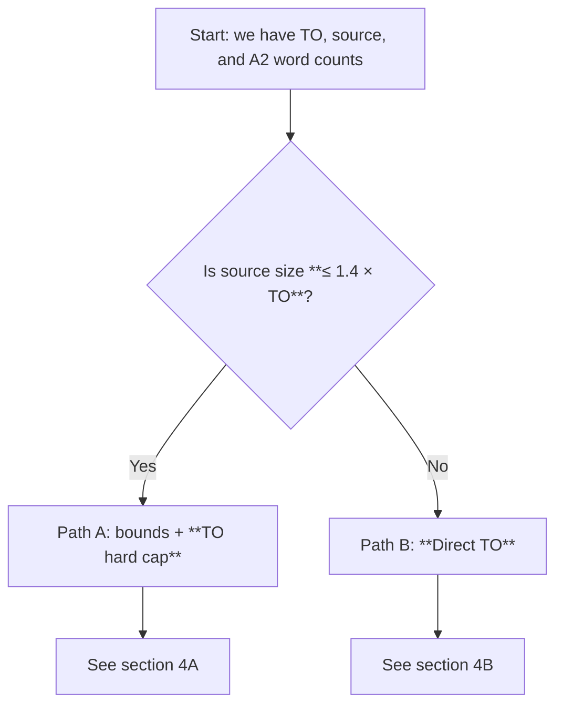
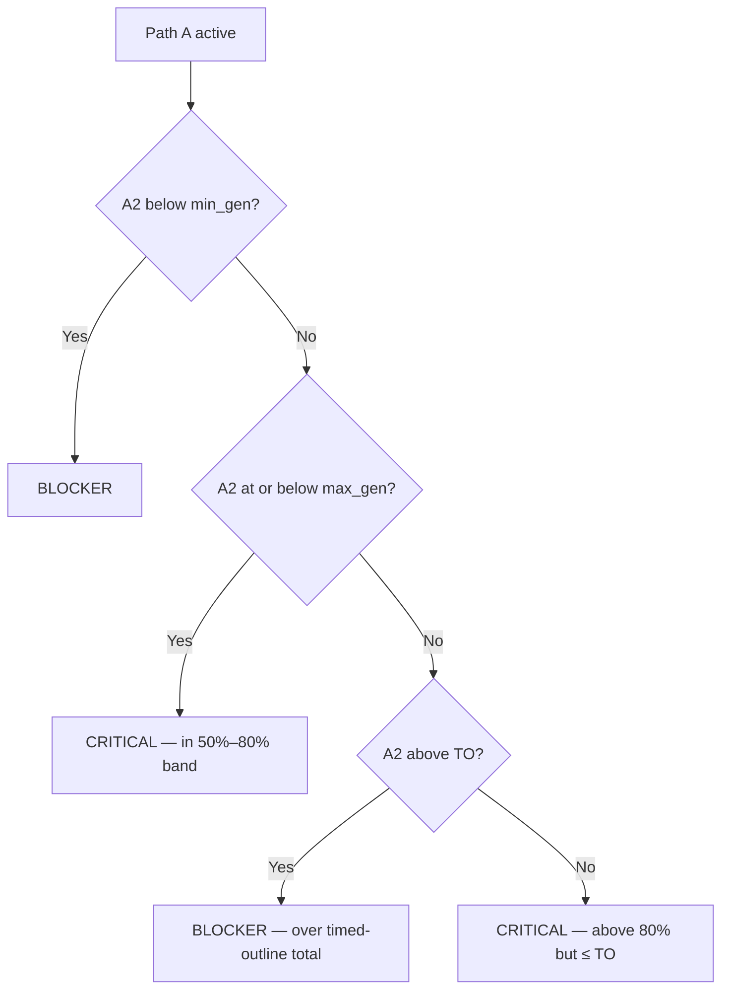
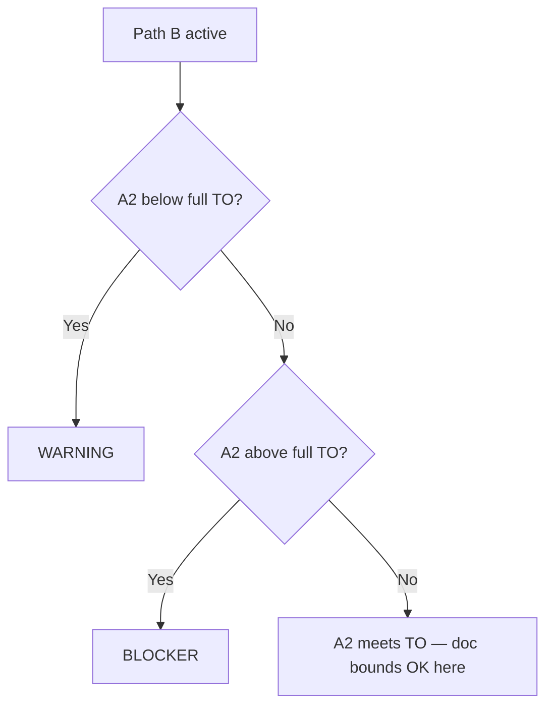

# Word Count Check — Plain Guide (`doc_bounds`)

This note explains **why** and **how** the system checks the **length of the generated course** (A2 output) before the final Word document is approved. It is written for **non-technical readers** first, then adds **numbers and sample outputs** for people who work with JSON or validation reports.

---

## 1. The idea in one minute (no math)

- The **Timed Outline (TO)** says how long the course is **supposed** to be (a target word count the client agreed on).
- The **source study guide** is the long document the client uploaded. It can be **short** (similar to the target) or **huge** (much longer than the target).
- The system **does not** copy the source word-for-word. It **rewrites** content, so the final length will not match the source page count.
- The check answers: *“Is our generated course about the right length for this situation — not empty, not bloated?”*

**Two different rules** are used, depending on how big the source is compared to the TO target:

| Situation (simple) | Rule in one sentence |
|--------------------|----------------------|
| Source is **not** much larger than the TO (source size ≤ 1.4 × TO) — **Path A** | Use a **soft band** (50%–80% of TO) plus a **hard cap at TO**: under the soft minimum → blocker; in the soft band → critical (review); **between 80% and 100% of TO** → still **critical** (review), **not** blocked; **above full TO** → **blocker**. |
| Source is **much** larger than the TO (source > 1.4 × TO) — **Path B** | Compare A2 **directly** to the **full TO**. Under TO → warning; over TO → blocker. |

If the “direct TO” path passes with **no** doc-bounds issues, the system can run a **deviation** check: *is the total still within a small % of the TO number stored in the section map?*

---

## 2. The three numbers the code uses

| Name (in words) | Where it comes from (technical) | What it means |
|-----------------|----------------------------------|---------------|
| **TO target** | `extracted_inputs.to_outline_total_word_count` | How many words the **Timed Outline** says the course should be. |
| **Source document size** | `extracted_inputs.total_doc_word_count` | How many words are in the **uploaded study guide** (roughly). |
| **Generated total (A2)** | `a2_output.stats.total_words` | How many words the system **actually wrote** for the course. |

If any of these is missing or zero, the doc-bounds check **skips** (no issue from this function).

---

## 2.1 The “min / max” you see in messages: `min_gen` and `max_gen` (Path A only)

| Name in code / JSON | Plain meaning | How it is calculated |
|---------------------|---------------|----------------------|
| **`min_gen`** | **Minimum** words A2 should reach on Path A | **50% of TO** |
| **`max_gen`** | **Soft ceiling** — guidance band, **not** a hard blocker by itself | **80% of TO** |

On Path A:

```text
min_gen          max_gen                              TO (hard ceiling for Path A)
  |----------------|----------------------------------------|
  blocker if      critical if       CRITICAL if           BLOCKER if
  A2 below        A2 in             max_gen < A2 ≤ TO      A2 > TO
                  [min_gen,max_gen]
```

- **Below `min_gen`** → **blocker** (`doc_bounds.min_gen`).
- **Between `min_gen` and `max_gen` (inclusive)** → **critical** (`doc_bounds.in_bounds_band`) — mandatory review.
- **Above `max_gen` but still `≤ TO`** → **critical** (`doc_bounds.above_max_within_to`) — “passed” in the sense of **not blocked**; still needs **review** (over the 80% soft line but not over the course total).
- **Above `TO`** → **blocker** (`doc_bounds.bounds_path_over_to`) — must trim or regenerate.

**Path B** (rich source) does **not** use `min_gen` / `max_gen`. It only compares A2 to **full TO** (under → warning, over → `doc_bounds.direct_to_over`).

---

## 3. The fork: “small-ish source” vs “rich source”

The system compares **source** to **1.4 × TO** (140% of the Timed Outline total). Call that number the **rich line**.



---

## 4A. Path A — Bounds path (source ≤ 1.4 × TO)

Let **TO** = Timed Outline target. **min_gen** = 50% of TO, **max_gen** = 80% of TO.



**Summary**

| A2 vs TO / band | Severity |
|-----------------|----------|
| A2 &lt; min_gen | Blocker |
| min_gen ≤ A2 ≤ max_gen | Critical (in band) |
| max_gen &lt; A2 ≤ TO | Critical (above soft max, still OK vs TO) |
| A2 &gt; TO | Blocker |

---

## 4B. Path B — Direct TO (source &gt; 1.4 × TO)

Compare **A2** to **full TO** only.



When Path B yields **no issues** (typically A2 equals TO), the pipeline may run the **deviation** step.

---

## 5. Deviation check (after Path B lines up)

Uses **`error_tolerance.word_count_tolerance_percent`**: drift vs section-map TO → warning or blocker if beyond 3× tolerance.

---

## 6. Worked example (Path A)

Assume **TO** = 10,000, **Source** = 12,000 → Path A (12,000 ≤ 14,000).

- min_gen = **5,000**, max_gen = **8,000**

| A2 total | Result |
|----------|--------|
| 4,200 | Blocker (under min_gen) |
| 6,500 | Critical (in 50%–80% band) |
| 8,500 | Critical — **above max_gen but ≤ TO** (`above_max_within_to`) |
| 10,000 | Critical — at TO but still &gt; max_gen (same bucket: ≤ TO, &gt; max_gen) |
| 10,500 | Blocker — **over TO** (`bounds_path_over_to`) |

---

## 7. Sample issue objects

**Above soft max but within TO (critical):**

```json
{
  "field": "a2_output.stats.total_words",
  "severity": "critical",
  "rule_source": "doc_bounds.above_max_within_to",
  "message": "A2 generated 8500 words — above soft max_gen (8000) but still at or under TO (10000)."
}
```

**Over TO on Path A (blocker):**

```json
{
  "field": "a2_output.stats.total_words",
  "severity": "blocker",
  "rule_source": "doc_bounds.bounds_path_over_to",
  "message": "A2 generated 10500 words — above TO (10000) on bounds path."
}
```

---

## 8. Quick reference

| Path | When | Blocker | Critical | Warning |
|------|------|---------|----------|---------|
| A | Source ≤ 1.4×TO | Under min_gen **or** over **TO** | In 50–80% band **or** between 80% and 100% of TO | — |
| B | Source &gt; 1.4×TO | Over TO | — | Under TO |

---

## 9. Why this matters for CE

Regulators and clients expect the course to match **approved** length. Path A uses an **80% soft guide** but allows growth **up to the full TO** with review; anything **past TO** is blocked.

Implementation: `word_count_checks.py` — `check_word_count_against_doc_bounds`, `check_word_count_target`.
