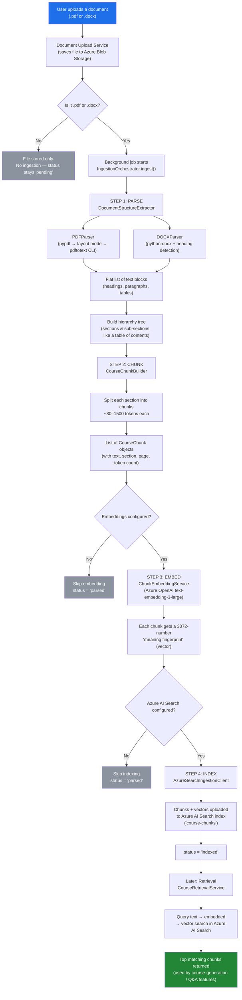

# Document Ingestion Pipeline

## What This Is (In Plain Words)

This module takes a document a user uploads (a `.pdf` or `.docx` file — for example, a
regulation, policy, or course source document) and turns it into something an AI can
"understand" and search through later.

Think of it like turning a book into a searchable index card system:

1. We **read** the document and figure out its structure (chapters, headings, paragraphs, tables).
2. We **cut it into bite-sized pieces** ("chunks") that are small enough for an AI model to work with, but large enough to still make sense on their own.
3. We **convert each piece into a list of numbers** (an "embedding") that captures its meaning — this is what lets the AI later find "documents about X" even if the exact words don't match.
4. We **store** those pieces and their number-representations in a searchable database (Azure AI Search) so they can be looked up quickly later — for example, when generating a course or answering a question.

Everything below explains how each of those four steps actually works, what tools/services
are involved, and what happens when something goes wrong (e.g., a scanned PDF with no
readable text, or missing configuration).

---

## End-to-End Flow Diagram

---

## The Four Steps, Explained

### Step 1 — Parse: "Read the document and find its structure"

**Files:** `parsers/pdf_parser.py`, `parsers/docx_parser.py`, `parsers/structure_extractor.py`

The system needs to know which lines are headings, which are body paragraphs, and which
are tables — the same way a human skims a document to find its outline.

- **PDF files** are the trickier of the two, because PDFs don't store "this is a heading"
  metadata — they just store text positioned on a page. So we try three approaches, in order,
  and use whichever works:
  1. Standard text extraction (`pypdf`).
  2. If a page comes back nearly empty (fewer than 20 characters), retry that page in
     "layout mode," which handles multi-column pages better.
  3. If more than half the pages are still coming back empty, fall back to a separate,
     more powerful command-line tool (`pdftotext`, part of a package called Poppler) that
     can handle unusual PDF encodings.
  - Headings are then guessed using simple rules: ALL-CAPS short lines, or lines that look
    like "1.2.3 Some Title."
  - If a PDF is a scanned image with no real text at all (no OCR is done), the system logs a
    warning and simply produces no content — it doesn't crash.

- **DOCX files** are easier because Word documents already have style information (e.g.,
  "Heading 1," "List Bullet"). We reuse a heading-detection helper already built for another
  part of the system to figure out the outline. Tables are flattened into a single line of
  text per table (cells joined by `|`).

- The result is a **tree** — like a table of contents — where each "section" (e.g., a chapter
  or heading) contains the paragraphs and tables that belong to it.

### Step 2 — Chunk: "Cut the tree into AI-sized pieces"

**File:** `chunking/chunk_builder.py`

AI models can only "read" a limited amount of text at once, and search works better on
smaller, focused pieces rather than one giant document. So each section is split into chunks:

- A chunk must be **at least ~80 tokens** (roughly 60 words) — otherwise it's too small to be
  meaningful, and the section's content is skipped.
- A chunk can be **at most ~1500 tokens** (roughly 1,100 words) — if a section is longer than
  that, it's split into multiple chunks (e.g., "Introduction (part 2)").
- ("Tokens" are the small text units AI models actually count — roughly ¾ of a word each.)
- Each chunk keeps track of which page/section it came from, an estimated reading time, and
  any metadata passed in (which course it belongs to, which jurisdiction, etc.), so results
  can later be filtered (e.g., "only show chunks from this specific document").

### Step 3 — Embed: "Give each chunk a meaning fingerprint"

**File:** `embedding/embedding_service.py`

This is where the AI comes in. Each chunk's text (up to 8,000 characters) is sent to an
Azure OpenAI embedding model (`text-embedding-3-large`), which converts the text into a
list of **3,072 numbers**. Chunks with similar meaning end up with similar numbers — this is
what makes it possible to later search by *meaning* instead of by exact keyword match.

- Chunks are sent in small batches of 16 at a time (to stay within API limits).
- Every embedding request is logged for cost/performance tracking.
- If the embedding service is unreachable or misconfigured, ingestion **stops and fails**
  rather than silently storing chunks with no meaning-fingerprint — a half-indexed,
  unsearchable document is worse than no document.
- If no embeddings service is configured at all (e.g., in a local dev environment without
  credentials), this step is **skipped gracefully**, and the document stays in a `parsed`
  state rather than failing outright.

### Step 4 — Index: "File it away for fast searching"

**Files:** `storage/index_schema.py`, `storage/azure_search_client.py`

The chunks (text + metadata + the 3,072-number fingerprint) are uploaded to **Azure AI
Search**, into an index called `course-chunks` by default. Think of this as a specialized
database built for exactly this kind of "search by meaning" lookup.

- The index is created automatically the first time it's needed, using a predefined schema
  (what fields exist: chunk text, section title, page number, course ID, etc.).
- Chunks are uploaded in small batches of 15 (kept small because the number-fingerprints are
  large and Azure has a size limit per upload batch).
- Before uploading, the system double-checks that every chunk actually has a valid
  fingerprint of the right size — it refuses to upload incomplete data.
- If Azure AI Search isn't configured, this step is skipped and the document is left in the
  `parsed` state (parsed and chunked, but not searchable yet).

---

## What Happens After Ingestion: Retrieval

**File:** `storage/retrieval_service.py`

Once documents are indexed, other parts of the system (like course-generation features) can
ask questions such as *"find the most relevant chunks about workplace safety training"*.

How it works:
1. The question/topic text is turned into a 3,072-number fingerprint using the same embedding
   model used during ingestion.
2. Azure AI Search compares that fingerprint against every stored chunk's fingerprint and
   returns the closest matches (**pure meaning-based search — no plain keyword matching**).
3. Results can optionally be filtered to a specific document.
4. There's also a plain lookup to fetch *all* chunks belonging to one section, in original
   order — useful for reconstructing the full text of a section rather than just a snippet.

If the embedding step fails at query time (e.g., service outage), the search simply returns
no results rather than falling back to a lower-quality keyword search — this is a deliberate
design choice to keep result quality consistent.

---

## Status Lifecycle

Every uploaded document moves through these states (visible via the upload status API):

| Status | Meaning |
|---|---|
| `pending` | File uploaded, ingestion not started yet (or file type isn't supported for ingestion) |
| `processing` | Parsing/chunking/embedding/indexing currently running in the background |
| `parsed` | Parsed and chunked successfully, but embedding and/or search indexing were skipped (usually due to missing configuration) |
| `indexed` | Fully processed — searchable in Azure AI Search |
| `failed` | An error occurred during embedding or indexing (parsing/chunking succeeded, but the document is not usable for search) |

---

## Configuration Reference

These are set via environment variables (see `app/core/config.py`, `IngestionSettings`):

| Setting | Env Variable | Default | Purpose |
|---|---|---|---|
| Search endpoint | `AZURE_SEARCH_ENDPOINT` | — | Azure AI Search service URL |
| Search API key | `AZURE_SEARCH_API_KEY` | — | Auth for Azure AI Search |
| Search index name | `AZURE_SEARCH_INDEX_NAME` | `course-chunks` | Where chunks are stored |
| Embeddings resource | `AZURE_OPENAI_EMBEDDINGS_RESOURCE_NAME` | — | Dedicated Azure OpenAI resource for embeddings |
| Embeddings key | `AZURE_OPENAI_EMBEDDINGS_KEY` | — | Auth for the embeddings resource |
| Embedding deployment/model | `INGESTION_EMBEDDING_DEPLOYMENT` | `text-embedding-3-large` | Which embedding model to call |
| Max chunk size | `INGESTION_MAX_CHUNK_TOKENS` | `1500` | Upper bound per chunk |
| Min chunk size | `INGESTION_MIN_CHUNK_TOKENS` | `80` | Lower bound; smaller sections are dropped |

If the dedicated embeddings resource isn't configured, the system automatically falls back
to reusing the main Azure OpenAI credentials already used elsewhere in the app
(`AZURE_OPENAI_ENDPOINT` / `AZURE_OPENAI_API_KEY`).

**Other fixed technical settings** (not configurable via environment variables):

- Embedding vector size: 3,072 numbers per chunk
- Embedding batch size: 16 chunks per API call
- Search upload batch size: 15 chunks per API call
- Default number of results returned by a search query: 5
- PDF page considered "empty"/needs fallback extraction: fewer than 20 characters
- Reading-time estimate: 200 words per minute

---

## Supported File Types

| Type | Notes |
|---|---|
| `.pdf` | Three-tier text extraction for reliability; heading levels are guessed heuristically; page numbers preserved; no OCR — scanned/image-only PDFs will produce no content |
| `.docx` | Uses Word's built-in heading/list styles for structure; tables flattened to single text lines; no page numbers (Word documents don't have fixed pages) |

Any other file extension is not ingested — the file is still stored, but no AI processing
happens.

---

## External Services & Dependencies

- **Azure Blob Storage** — stores the original uploaded file (handled outside this module, by the upload service).
- **Azure OpenAI (`text-embedding-3-large`)** — generates the meaning-fingerprints for each chunk.
- **Azure AI Search** — stores and searches the chunks and their fingerprints.
- **Poppler (`pdftotext`)** — an external system tool used as a last-resort PDF text extractor; if it isn't installed on the server, only the first two PDF extraction methods are available.
- **tiktoken** (optional) — used for precise chunk-size counting; if not installed, a word-count estimate is used instead.

---

## Quick Glossary

- **Chunk** — a small, self-contained piece of a document (a few paragraphs), the unit everything downstream operates on.
- **Embedding / Vector** — a list of numbers representing the *meaning* of a piece of text, generated by an AI model.
- **Vector search** — searching by comparing meaning-fingerprints instead of matching exact words.
- **Index** — the searchable database (Azure AI Search) where chunks and their fingerprints live.
- **Token** — the small unit of text AI models process; roughly ¾ of an English word.
